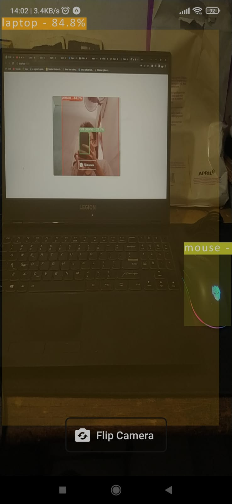

# YOLOv5 on Multi Platform Using `tfjs-react-native`

<p align="center">
  
</p>


---

Object Detection using YOLOv5 on multiplatform using `tensorflowjs` and `react-native`.

## Platforms

Tested platforms.

| Platforms |                                       Status                                       |                      |
| :-------: | :--------------------------------------------------------------------------------: | :------------------- |
|  Android  |  | Backend : `rn-webgl` |
|    Ios    |                           | Can't afford ☕      |
|    Web    |                     | Backend : `webgl`    |

## Run on Expo Go

**Setup**

Install main dependencies.

```bash
$ yarn
```

**Run the app~~**

```bash
$ yarn start
```

Open `Expo Go` app in your device and scan the QR code.

**Open WebApp**

```bash
$ yarn web
```

## Model

YOLOv5n model converted to tensorflow.js.

```
used model : yolov5n
size       : 7.5 Mb
```

**Use another model**

Use another YOLOv5 model.

1. Clone [yolov5](https://github.com/ultralytics/yolov5) repository

   ```bash
   git clone https://github.com/ultralytics/yolov5.git && cd yolov5
   ```

   Install `requirements.txt` first

   ```bash
   pip install -r requirements.txt
   ```

2. Export model to tensorflow.js format
   ```bash
   export.py --weights yolov5*.pt --include tfjs
   ```
3. Copy `yolov5*_web_model` to `./assets/model`
4. Update model path in `src/modelHandler/index.js` (Android) or `src/modelHandler/index.web.js` (Web)

   `src/modelHandler/index.js`

   ```js
   ...
   // model path
    const modelJson = require("../../assets/model/<NEW-MODEL>/model.json");
    const modelWeights = [
        require("../../assets/model/<NEW-MODEL>/<1>.bin"),
        require("../../assets/model/<NEW-MODEL>/<2>.bin"),
        ...
    ];
   ...
   ```

   **Note** : In Android you must specify all `.bin` files

   `src/modelHandler/index.web.js`

   ```js
   ...
   export const modelURI = `${window.location.origin}/model/<NEW-MODEL>/model.json`;
   ```

5. Done! 😊

**Note** : For custom trained model you need to update `src/utils/labels.json` with your current model labels.

## Reference

https://github.com/ultralytics/yolov5
